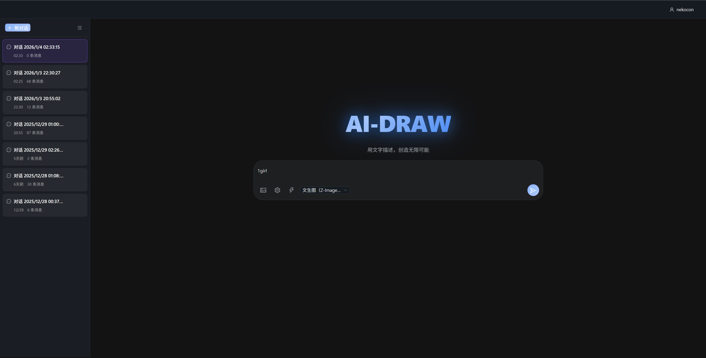

# AI-Draw

> AI 辅助绘画工具，基于 ComfyUI 的智能图像生成平台



## 🎉 v2.0 稳定版

**当前状态**: 全栈应用完成 ✅ | 生产可用 🚀

- ✅ 后端模块化架构（API 拆分为独立模块）
- ✅ React 前端完整实现
- ✅ 用户认证和数据持久化
- ✅ 聊天式交互界面
- ✅ 多会话管理
- ✅ Docker 容器化部署

## 项目简介

AI-Draw 是一个现代化的 AI 辅助绘画 Web 应用，为插画师、设计师和创作者提供便捷的 AI 图像生成能力。采用 FastAPI + React 前后端分离架构，通过简单的提示词和参数设置，结合本地或云端 ComfyUI 后端，即可一键生成高质量的创意图像。

## 主要特性

- 🎨 **多种工作流**：支持"文生图"、"图生图"、"参考图（SDXL/Z-Image）"等多种专业工作流
- 🤖 **智能 Prompt 生成**：接入 OpenAI 兼容 API，根据中文描述自动生成英文提示词
- ⚡ **实时通信**：基于 WebSocket 的实时状态推送和进度更新
- 🖼️ **图片上传**：支持拖拽、粘贴、文件选择多种图片上传方式
- 🎛️ **精准控制**：重绘强度、生成数量、LoRA 提示词等参数可调
- 📊 **批量生成**：支持一次生成多张图像（1-8 张）
- 💬 **聊天式界面**：现代化对话式交互，支持多会话管理
- 👤 **用户系统**：注册登录、配置持久化、数据隔离
- 🌐 **现代化界面**：React + TypeScript + Ant Design 构建的响应式 UI
- 🐳 **容器化部署**：Docker Compose 一键部署，开箱即用

## 技术栈

### 后端
- **FastAPI** - 现代 Python Web 框架
- **WebSocket** - 实时双向通信
- **Pydantic v2** - 数据验证和配置管理
- **SQLAlchemy 2.0** - ORM 数据库操作
- **PostgreSQL 15** - 关系型数据库
- **JWT (python-jose)** - 用户认证和授权
- **ComfyUI** - AI 图像生成后端

### 前端
- **React 19** + **TypeScript 5.9** - 现代前端框架
- **Zustand 5** - 轻量级状态管理
- **Ant Design 6** - 企业级 UI 组件库
- **Axios** - HTTP 客户端
- **Vite 7** - 快速构建工具
## 快速开始

### 环境要求
- Python 3.13+
- Node.js 18+
- PostgreSQL 15+
- ComfyUI（本地或云端）

### Docker 部署（推荐）🐳

**快速启动**

```bash
# 1. 克隆项目
git clone https://github.com/nekocon233/ai-draw.git
cd ai-draw

# 2. 配置环境变量
cp .env.example .env
# 编辑 .env 文件，填入必要配置（API密钥、数据库密码等）

# 3. 启动所有服务
docker compose up -d

# 4. 查看运行状态
docker compose ps

# 5. 访问应用
# 前端：http://localhost:14601
# 后端 API：http://localhost:14600/docs
```

**常用命令**

```bash
# 查看日志
docker compose logs -f ai-draw-backend

# 停止服务
docker compose down

# 重新构建（代码更新后）
docker compose down && docker compose build --no-cache ai-draw-backend && docker compose up -d
```

### 本地开发

1. **安装后端依赖**
   ```bash
   python -m venv .venv
   source .venv/bin/activate  # Linux/Mac
   # .venv\Scripts\activate   # Windows
   pip install -r requirements.txt
   ```

2. **配置数据库**
   - 安装并启动 PostgreSQL
   - 创建数据库：`ai_draw`
   - 在 `.env` 中配置数据库连接信息

3. **安装前端依赖**
   ```bash
   cd frontend
   npm install
   ```

4. **启动服务**
   ```bash
   # 后端（项目根目录）
   python run.py
   
   # 前端（frontend目录）
   npm run dev
   ```

5. **访问应用**
   - 前端：http://localhost:5173（开发模式）
   - 后端 API：http://localhost:14600/docs

### ComfyUI 配置

AI-Draw 需要 ComfyUI 作为图像生成后端：

**Docker 环境访问宿主机 ComfyUI**
- Windows/Mac: 在 docker-compose.yml 中 `COMFYUI_HOST=host.docker.internal`
- Linux: 在 docker-compose.yml 中 `COMFYUI_HOST=172.17.0.1`

**本地开发**
- 确保 ComfyUI 运行在 8188 端口
- 或在环境变量中配置 `COMFYUI_HOST` 和 `COMFYUI_PORT`

## 工作流配置

当前支持的工作流类型（在 `configs/app_config.yaml` 中配置）：

| 工作流 ID | 名称 | 描述 | 需要参考图 |
|-----------|------|------|-----------|
| `t2i` | 文生图（Z-Image） | 纯文本生成图像 | ❌ |
| `i2i` | 图生图（Q-Image） | 基于参考图重绘 | ✅ |
| `reference` | 参考图（SDXL） | SDXL 参考图工作流 | ✅ |
| `reference_zimage` | 参考图（Z-Image） | Z-Image Turbo 参考图工作流 | ✅ |

工作流文件位于 `configs/workflows/` 目录，前端通过 `/api/service/workflows` 接口动态获取可用工作流列表。

## 配置说明

### 配置系统架构

AI-Draw 采用**单一数据源**原则管理配置：

| 配置类型 | 唯一来源 | 示例 |
|---------|---------|------|
| **端口** | `docker-compose.yml` environment | `SERVER_PORT=14600` |
| **密钥/密码** | `.env` | `AI_PROMPT_API_KEY=sk-xxx` |
| **工作流配置** | `configs/app_config.yaml` | 工作流元数据和参数定义 |

### .env 环境变量

```env
# AI Prompt API 密钥（必需）
AI_PROMPT_API_KEY=your-api-key-here

# JWT 认证密钥（必需）
JWT_SECRET_KEY=your-jwt-secret-key-here

# 数据库密码（必需）
DB_PASSWORD=your-secure-password-here

# Redis 密码（可选）
REDIS_PASSWORD=

# 生产环境域名
PRODUCTION_DOMAIN=https://your-domain.com
```

### docker-compose.yml 端口配置

```yaml
environment:
  - SERVER_PORT=14600          # 后端 API 端口
  - FRONTEND_HTTP_PORT=14601   # 前端 HTTP 端口
  - FRONTEND_HTTPS_PORT=14602  # 前端 HTTPS 端口
```

## API 文档

启动服务后访问：
- Swagger UI: http://localhost:14600/docs
- ReDoc: http://localhost:14600/redoc

### 主要端点

| 端点 | 方法 | 描述 |
|------|------|------|
| `/api/service/status` | GET | 检查服务状态 |
| `/api/service/workflows` | GET | 获取可用工作流列表 |
| `/api/prompt/generate` | POST | 生成 AI Prompt |
| `/api/image/generate` | POST | 生成图像 |
| `/api/image/upload` | POST | 上传参考图片 |
| `/api/user/register` | POST | 用户注册 |
| `/api/user/login` | POST | 用户登录 |
| `/api/user/config` | GET/PUT | 用户配置 |
| `/api/session/*` | - | 聊天会话管理 |
| `/ws` | WebSocket | 实时通信 |

## 项目结构

```
ai-draw/
├── run.py                    # 应用启动入口
├── requirements.txt          # Python 依赖
├── docker-compose.yml        # Docker 开发环境配置
├── docker-compose.prod.yml   # Docker 生产环境配置
├── Dockerfile                # 后端容器构建文件
│
├── server/                   # FastAPI 后端
│   ├── main.py              # 应用入口和生命周期
│   ├── ai_draw_service.py   # 核心业务服务
│   ├── database.py          # 数据库连接
│   ├── models.py            # ORM 模型
│   ├── schemas.py           # Pydantic 数据模型
│   ├── auth.py              # JWT 认证
│   ├── api/                 # REST API 路由模块
│   │   ├── __init__.py      # 路由聚合
│   │   ├── image.py         # 图像生成 API
│   │   ├── prompt.py        # Prompt 生成 API
│   │   ├── service.py       # 服务管理 API
│   │   ├── user.py          # 用户认证 API
│   │   └── session.py       # 会话管理 API
│   ├── middleware/          # 中间件
│   │   └── error_handler.py # 统一错误处理
│   └── websocket/           # WebSocket 处理
│
├── frontend/                 # React 前端
│   ├── src/
│   │   ├── App.tsx          # 应用主组件
│   │   ├── main.tsx         # 入口文件
│   │   ├── api/             # API 客户端
│   │   │   ├── client.ts    # Axios 配置
│   │   │   ├── services.ts  # API 方法封装
│   │   │   └── websocket.ts # WebSocket 管理
│   │   ├── components/      # UI 组件
│   │   │   ├── ChatInput.tsx
│   │   │   ├── ChatSessionSidebar.tsx
│   │   │   ├── ResultGrid.tsx
│   │   │   ├── WorkflowSelector.tsx
│   │   │   ├── SettingsModal.tsx
│   │   │   ├── LoginModal.tsx
│   │   │   └── ...
│   │   ├── stores/          # Zustand 状态管理
│   │   │   └── appStore.ts
│   │   ├── types/           # TypeScript 类型
│   │   └── utils/           # 工具函数
│   └── package.json
│
├── comfyui/                  # ComfyUI 集成
│   ├── comfyui_service.py   # ComfyUI 服务封装
│   ├── requests/            # 请求处理
│   └── structures/          # 数据结构
│
├── configs/                  # 配置文件
│   ├── app_config.yaml      # 应用主配置
│   └── workflows/           # ComfyUI 工作流 JSON
│       ├── t2i_workflow_api.json
│       ├── qwen_image_edit_workflow_api.json
│       ├── reference_workflow_api.json
│       └── reference_zimage_workflow_api.json
│
├── utils/                    # 工具模块
│   ├── config_loader.py     # 配置加载器
│   ├── ai_prompt.py         # AI 提示词生成
│   ├── image_processor.py   # 图像处理
│   └── file_storage.py      # 文件存储
│
└── nginx/                    # Nginx 配置
    ├── nginx.conf
    └── docker-entrypoint.sh
```
## 使用说明

### 聊天式交互

AI-Draw 采用聊天式界面，支持：
- 📝 输入中文描述，自动生成英文提示词
- 🖼️ 上传参考图进行图生图
- 💬 多会话管理，历史记录自动保存
- ⚙️ 参数面板调整生成参数

## 用户认证与多用户支持

### 功能特性
- ✅ **用户注册/登录**：支持多用户独立账户
- ✅ **配置持久化**：用户配置自动保存到数据库
- ✅ **多会话管理**：支持创建和切换多个聊天会话
- ✅ **聊天历史**：每个会话的对话和生成记录独立存储
- ✅ **数据隔离**：用户之间数据完全隔离
- ✅ **游客模式**：未登录也可使用，但配置不保存

### 使用流程

1. **游客使用**：无需登录即可使用，配置仅保存在浏览器本地
2. **注册账户**：点击右上角"登录"按钮，切换到"注册"
3. **登录使用**：配置自动保存，支持多设备同步
4. **退出登录**：点击右上角用户名，选择"退出登录"

## 开发指南

### 后端开发

**核心服务层**（单例模式）：
```python
# server/ai_draw_service.py
class AIDrawService:
    def __init__(self):
        self.comfyui = ComfyUIService(request=LocalComfyUIRequest())
        self.ai_prompt = AIPrompt()
    
    async def generate_image(self, prompt, workflow, ...):
        # 图像生成逻辑
        pass
```

**依赖注入**：
```python
# API 端点使用
from server.ai_draw_service import get_ai_draw_service

@router.post("/api/image/generate")
async def generate(service: AIDrawService = Depends(get_ai_draw_service)):
    await service.generate_image(...)
```

### 前端开发

**状态管理**（Zustand）：
```typescript
// stores/appStore.ts
const { 
  prompt, setPrompt,
  currentWorkflow,
  chatSessions,
  loadUserConfig,
} = useAppStore();
```

**API 调用**：
```typescript
// api/services.ts
await apiService.login({ username, password });
await apiService.getUserConfig();
await apiService.generateImage({ prompt, workflow, ... });
```

### 添加新工作流

1. 在 ComfyUI 中设计工作流，导出 API JSON
2. 放入 `configs/workflows/` 目录
3. 在 `configs/app_config.yaml` 的 `workflow_files` 中注册
4. 在 `workflow_metadata` 中配置元数据（标签、描述、参数）
5. 前端 `WorkflowSelector` 组件会自动获取新工作流

## 更新日志

### v2.0 (2026-01)

- ✨ **全新架构**：FastAPI + React 19 前后端分离
- ✨ **用户系统**：支持注册/登录，多用户数据隔离
- ✨ **多会话管理**：支持创建和切换多个聊天会话
- ✨ **配置持久化**：用户配置自动保存到 PostgreSQL
- ✨ **聊天历史**：对话记录永久保存，支持加载历史
- 🎨 **现代 UI**：Ant Design 6，响应式设计
- ⚡ **实时通信**：WebSocket 推送生成状态和进度
- 🐳 **容器化**：Docker Compose 一键部署
- 📱 **移动友好**：适配多种屏幕尺寸

### v1.x (旧版)

- 支持多种工作流
- AI Prompt 生成
- 基础图像生成功能

## 常见问题

### 安装与配置

**Q: ComfyUI 连接失败？**  
A: 确认 ComfyUI 服务正在运行（默认端口 8188），检查 docker-compose.yml 中的 `COMFYUI_HOST` 配置

**Q: 数据库连接错误？**  
A: 确认 PostgreSQL 服务正在运行，`.env` 中的 `DB_PASSWORD` 已正确配置

**Q: 前端无法连接后端？**  
A: 确认后端服务运行正常，检查 CORS 配置是否包含前端地址

**Q: AI Prompt 生成失败？**  
A: 检查 `.env` 中的 `AI_PROMPT_API_KEY` 是否有效

### 使用问题

**Q: 配置不保存？**  
A: 未登录时配置仅保存在浏览器本地，需要登录账户才能持久化

**Q: 生成图片失败？**  
A: 检查 ComfyUI 工作流配置文件是否正确，模型文件是否存在

## 架构概览

### 后端架构
```
FastAPI Application
├── REST API (/api/*)
│   ├── service/   - 服务管理
│   ├── image/     - 图像生成
│   ├── prompt/    - Prompt 生成
│   ├── user/      - 用户认证
│   └── session/   - 会话管理
├── WebSocket (/ws) - 实时状态推送
├── Middleware - 统一错误处理
└── Database (PostgreSQL) - 用户数据持久化
```

### 前端架构
```
React Application
├── Components - UI 组件
├── Stores (Zustand) - 全局状态管理
└── API Layer - REST + WebSocket
```

## 错误处理

### 后端统一错误响应

```json
{
  "success": false,
  "error": {
    "code": "ERROR_CODE",
    "message": "错误描述"
  }
}
```

### 前端自动错误处理

- Axios 拦截器自动解析后端错误
- 自动显示 Ant Design 错误提示
- React ErrorBoundary 捕获组件错误

## Docker 高级配置

### 生产环境部署

```bash
# 使用生产配置（多 worker、资源限制）
docker compose -f docker-compose.prod.yml up -d
```

### 常用运维命令

```bash
# 进入后端容器
docker exec -it ai-draw-backend bash

# 数据库备份
docker exec ai-draw-postgres pg_dump -U ai_draw ai_draw > backup.sql

# 查看容器资源使用
docker stats
```

### 网络配置

**访问宿主机 ComfyUI**:
- Windows/Mac: `COMFYUI_HOST=host.docker.internal`
- Linux: `COMFYUI_HOST=172.17.0.1`

## 路线图

### 已完成 ✅
- [x] 后端模块化架构
- [x] React 前端完整实现
- [x] 用户认证和数据持久化
- [x] 多会话管理
- [x] Docker 容器化部署
- [x] 统一错误处理

### 计划中 📋
- [ ] 图片历史记录分页和搜索
- [ ] 主题切换（亮/暗）
- [ ] 性能优化（图片懒加载、React.memo）
- [ ] 后台任务队列（Celery）
- [ ] 单元测试和 E2E 测试

## 反馈与贡献

欢迎提交 issue 或 PR 参与改进！

📧 联系方式: [GitHub Issues](https://github.com/nekocon233/ai-draw/issues)

---

**最后更新**: 2026-01-04  
**维护者**: nekocon233

> 🎨 让 AI 成为你的创作助手，释放更多灵感！
