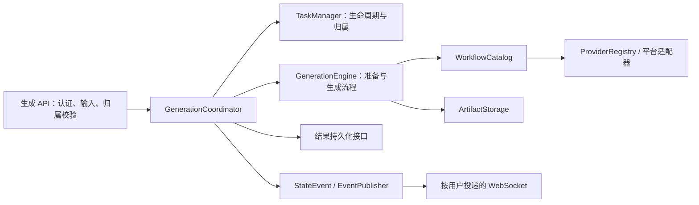

# 生成链路的模块边界

本次采用模块化单体，保留 FastAPI、React、Zustand、PostgreSQL 和现有 Docker Compose 部署。

## 后端职责

- `server/ai_draw_service.py` 是组装入口，保留 ComfyUI 服务控制、提示词生成和图片放大工具门面。
- `server/api/generation.py` 校验用户、会话、消息和参考图归属，调用生成服务；URL 仍为 `/api/media/*`。
- `server/api/media.py` 保留抽帧、背景处理、放大和导出等媒体工具接口。
- `server/generation/tasks.py` 集中管理单任务槽位。状态为 reserved → running → persisting → completed/error/cancelled；其他模块不再维护一组相互独立的全局布尔值。
- `coordinator.py` 负责占位、执行、结果提交、取消和清理，依赖生成与持久化的窄接口。
- `providers.py` 的每个适配器只生成一个媒体结果。取消、准备和专用校验是独立的可选能力，不要求所有外部 API 实现无意义的方法。
- `engine.py` 统一参考图规范化、逐个生成和产物通知；`storage.py` 统一使用配置的上传目录，在线程中完成解码、缩放和文件写入。
- `persistence.py` 保留现有数据库事务：重新生成时保留旧结果，新结果提交成功后才清理旧文件。
- `server/websocket/manager.py` 只负责连接投递；`routes.py` 负责认证和握手。事件在创建时固定用户、会话和任务身份，不再回读可变服务上下文。

## 任务与兼容性

仍只允许一个生成任务占用运行槽位，以兼容现有 ComfyUI 执行方式；本次没有引入多进程队列。

- 任务占位在首次 await 之前完成。
- 停止请求验证用户归属；可选 `task_id` 防止旧页面停止同一用户的新任务。
- 停止操作不能打断结果提交；取消普通生成后等待清理完成。
- 单个文件写入被取消时，先等待后台写入结束，再删除文件。批量生成中途失败时清理已生成的临时结果。
- `POST /api/media/generate` 保留 `count`、`images`，新增返回实际 `task_id`；旧请求仍可不传任务 ID。
- 任务快照保留旧的 running/completed/error 状态，新增内部阶段信息；快照按用户隔离，30 分钟过期，最多保留 256 个已完成用户快照。
- 私有事件必须有明确接收用户；公共广播仅允许服务可用性和工作流切换状态。
- 提示词生成的进行中状态按用户计数，避免其他用户重连时看到不属于自己的状态。

任务和快照仍在进程内，重启不能恢复执行。上传资源仍遵循现有 Caddy 静态文件访问方式；本次没有变更静态文件访问控制或数据库结构。

外部同步 API 不一定支持服务端取消；取消本地等待后，其调用线程可能继续执行，但不会再发布结果。ComfyUI 继续按原生任务 ID 中断。

## 新增工作流

1. 在 YAML 元数据中声明 `provider`、输入能力、输出类型和参数。
2. 复用现有 Provider 时，无需修改任务编排和 WebSocket。
3. 新平台实现 `GenerationProvider.generate`，返回 `MediaOutput`，在注册表组装入口注册。
4. 有原生取消能力时单独注册 interrupt；专用参数约束通过 validate 注册。
5. ComfyUI 工作流继续登记 workflow_files 和 API JSON，保持原有编码兼容。
6. 工作流目录统一提供发现、校验与 max_count；前端按能力确定生成数量和通用选项。

## 前端职责

- `App.tsx` 保留应用布局、认证入口和主题管理。
- `features/generation/useGenerationConnection.ts` 管理初始化加载和 WebSocket 订阅。
- `features/generation/events.ts` 是可脱离 React 测试的事件处理器，依赖窄状态接口，过滤旧任务和无归属事件。
- `features/generation/slice.ts` 集中管理开始、结束、停止和结果补拉。revision 防止迟到的旧请求覆盖新任务状态。
- 聊天消息类型统一使用 `types/models.ts`；旧 `types/store.ts` 转为活动 store 类型的兼容导出。
- `buildWorkflowTransition` 只调整与生成方式相关的参数：切换方式不改写输入栏的提示词、参考图和首尾帧。目标方式放不下的参考图按 `utils/workflowOptions.ts` 的 `carryReferenceImages` 暂存到 `parkedReferences`，换回可容纳的方式时按原顺序回到输入栏；LoRA 和尺寸仍按方式记忆在 `workflowSettingsStash`。
- 帧编辑、撤销重做和导出交互保持原有实现。

## 设计原则的落点

| 原则 | 约束 |
| --- | --- |
| 单一职责 | 任务、生成流程、平台调用、存储、数据库和传输分别变化 |
| 开闭原则 | 工作流绑定和平台注册是扩展入口，编排无需增加平台分支 |
| 里氏替换 | Provider 返回同一媒体契约；统一检查输出类型和空结果 |
| 依赖倒置 | 协调器依赖生成与结果存储接口，数据库和平台是具体适配器 |
| 接口隔离 | 生成必需能力与取消等可选能力分开 |
| 迪米特法则 | 路由和 WebSocket 不读写服务内部的任务协程与上下文字段 |

## 验证与部署

新增回归测试覆盖任务竞争、用户隔离、旧任务停止、取消清理、提交期间取消、数据库回滚、Provider 契约、HTTP 认证和前端断线恢复。

使用项目约定的后端测试、前端测试、lint 和生产构建命令。主机版本不匹配时，可在项目 Python 3.10 运行镜像和 Node 22 容器中运行测试。测试容器不连接线上数据库，也不调用收费的模型服务。

最终部署仍执行 `deploy: remote` 或它的等效顺序，统一通过 `DOCKER_HOST=ssh://nekocon-server`，只删除 frontend-dist，保留数据库、上传文件、模型缓存及订阅认证卷。
